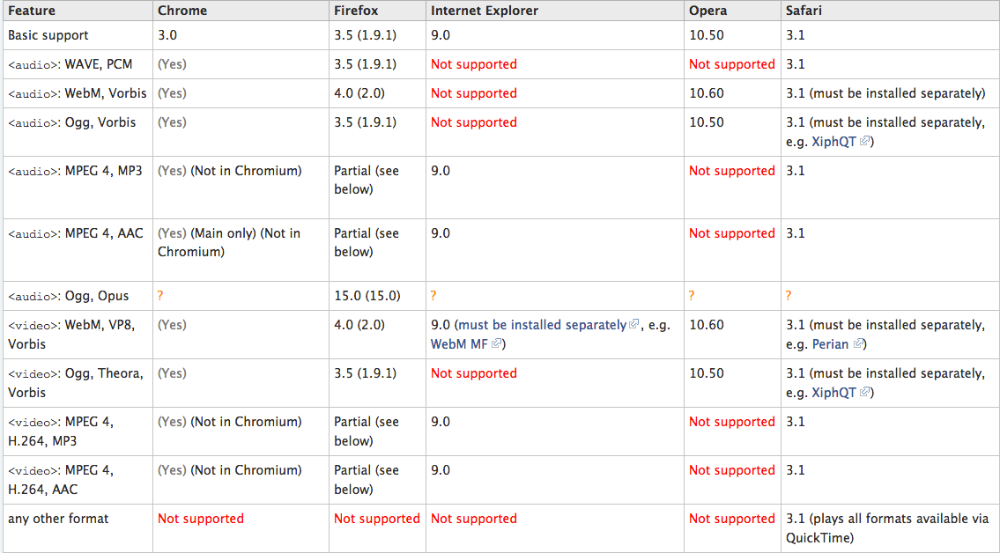

## Codecs



--

# canPlayType

```javascript
var audio = new Audio();
audio.canPlayType('audio/webm');
// "maybe"

audio.canPlayType('audio/webm; codecs="vorbis"');
// "probably"

audio.canPlayType('audio/obscure-type');
// ""
```
* Chrome on OSX

--

# Full Browser Support

* MP3
  * Chrome
  * IE
  * Safari
  * Some FF
* WebM (or Ogg)
  * Chromium
  * FF
  * Opera
  * Chrome, Safari also support these

--

# Which File?

```javascript
var audio = new Audio();

var sounds = [
  { type: 'audio/mpeg', filename: 'epic-theme.mp3' },
  { type: 'audio/webm', filename: 'epic-theme.webm' }
];

// Try the first sound that doesn't return ''
sounds.some(function(sound){
  return audio.canPlayType(sound.type) && (audio.src = sound.filename);
});
// Chrome, IE, Safari, Some FF: audio.src === 'epic-theme.mp3'
// Chromium, FF, Opera: audio.src === 'epic-theme.webm'
```
[Fiddle](http://jsfiddle.net/phated/YbjL9/)

--

# Don't Silence Me

```javascript
audio.addEventListener('error', function(){
  // Filter the current sound from list
  sounds = sounds.filter(function(sound){
    return audio.src.indexOf(sound.filename) < 0;
  });

  // Try the next sound that doesn't return ''
  sounds.some(function(sound){
    return audio.canPlayType(sound.type)
      && (audio.src = sound.filename);
  });
});
```
[Fiddle](http://jsfiddle.net/phated/YbjL9/4/)

--

# Maybe Try Probably

```javascript
var sources = sounds.reduce(function(result, sound){
  var canPlay = audio.canPlayType(sound.type);
  // Unshift the probablies onto beginning of the array
  if(canPlay === 'probably') result.unshift(sound.filename);
  // Push the maybes onto the end of the array
  if(canPlay === 'maybe') result.push(sound.filename);
  return result;
}, []);

audio.addEventListener('error', setSrc);

// Use the first sound on the array - probablies before maybes
function setSrc(){
  sources.length && (audio.src = sources.shift());
}

setSrc();
```
[Fiddle](http://jsfiddle.net/phated/YbjL9/6/)

--

# Function-ize

```javascript
function load(filename){
  var audio = new Audio();
  // Replace static filenames with the variable passed in
  var sounds = [
    { type: 'audio/mpeg', filename: filename + '.mp3' },
    { type: 'audio/webm', filename: filename + '.webm' }
  ];
  // All That Boilerplate
  return audio;
}

load('epic-theme').play();
load('sad-song').play();
```
[Fiddle](http://jsfiddle.net/phated/YbjL9/8/)

--

## It's My Party And I'll AMD If I Want To

```javascript
define([
  'frozen/plugins/loadSound!epic-theme'
], function(theme){

  // theme will be a Sound object based on Web Audio,
  // HTML5 Audio, or stubbed out if neither available
  // It will also try to use the best available codec

  theme.play();

});
```
[Fiddle](http://jsfiddle.net/phated/PN7EM/)

<aside class="notes">
  Frozen uses AMD plugins to make loading and using resources easier <br>
  Can pass a filename without extension - auto determine which codec to use <br>
  Also determines if WebAudio is available - defaults to that <br>
  Then HTML5 Audio <br>
  Otherwise stubbed out sound <br>
  A lot of these headaches are already abstracted away from you
</aside>
