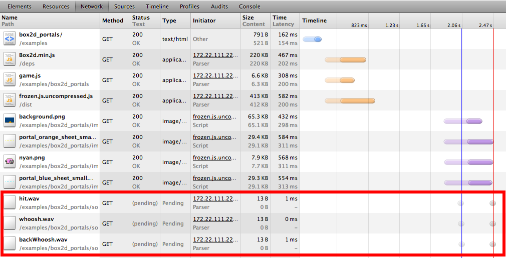
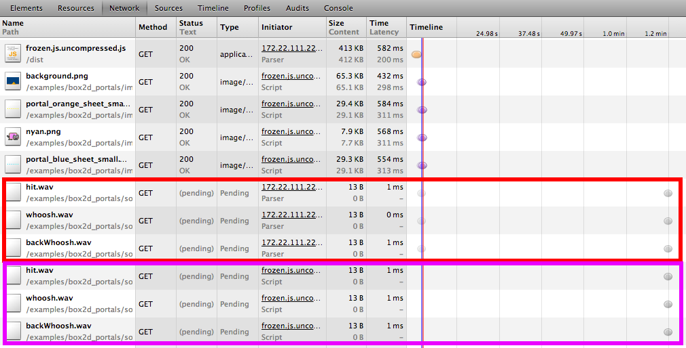
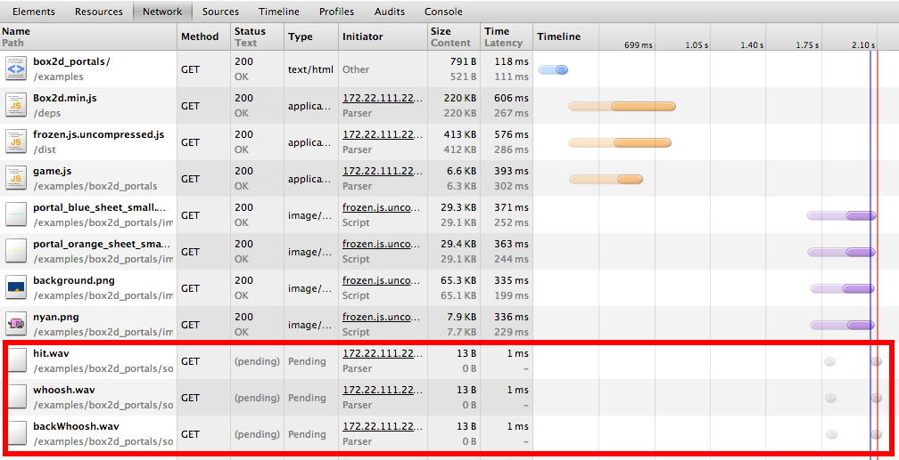
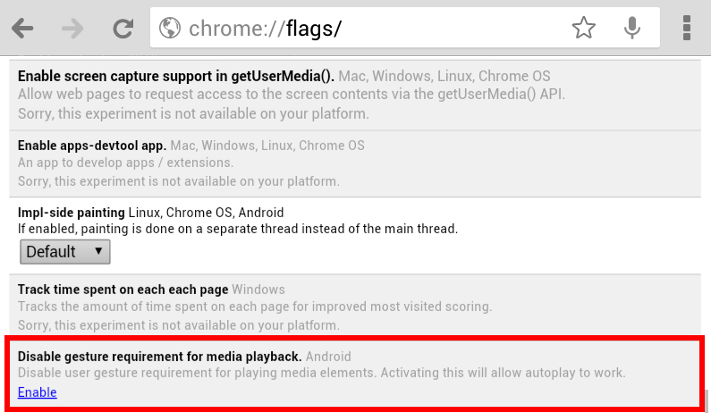

# What's Expected?

## `audio.play()`
## `audio.load()`

--

## media.load()

Causes the element to reset and start selecting and loading a new media resource from scratch.

[Spec](http://www.w3.org/html/wg/drafts/html/master/embedded-content-0.html#loading-the-media-resource)

## media.play()

Sets the paused attribute to false, <div class="fragment grow highlight-red">loading the media resource</div> and beginning playback if necessary. If the playback had ended, will restart it from the start.

[Spec](http://www.w3.org/html/wg/drafts/html/master/embedded-content-0.html#playing-the-media-resource)

--

## Don't Need No Stinkin' Spec


<br />


--

# Excuses, Excuses

"In Safari on iOS (for all devices, including iPad), where the user may be on a cellular network and be charged per data unit, <span class="fragment highlight-red">preload and autoplay are disabled.</span>
No data is loaded until the user initiates it. This means the <span class="fragment highlight-red">JavaScript play() and load() methods are also inactive until the user initiates playback,</span>
unless the play() or load() method is triggered by user action. In other words, a user-initiated Play button works, but an onLoad="play()" event does not."

[Source](http://developer.apple.com/library/safari/#documentation/AudioVideo/Conceptual/Using_HTML5_Audio_Video/Device-SpecificConsiderations/Device-SpecificConsiderations.html)

--

# On the Bandwagon

"This is intended. Autoplay is not honored on android as it will cost data usage."

[Source](https://code.google.com/p/chromium/issues/detail?id=138132#c6)

--

# Meanwhile

We can download terabytes of images without any restrictions

--

# Workaround

```javascript
var audio = new Audio();

audio.src = 'epic-theme.mp3';

function preloadSound(){
  audio.load();
  document.removeEventListener('touchstart', preloadSound);
}

document.addEventListener('touchstart', preloadSound);
```
[Fiddle](http://jsfiddle.net/phated/zAuXL/)

--

## All Is Good



--

## Nothing As It Seems



--

# We Can Do Better!

```javascript
var audio = new Audio();

audio.src = 'epic-theme.mp3';

function preloadSound(){
  var vol = audio.volume;
  audio.volume = 0;
  audio.play();
  audio.pause();
  audio.volume = vol;
  document.removeEventListener('touchstart', preloadSound);
}

document.addEventListener('touchstart', preloadSound);
```
[Fiddle](http://jsfiddle.net/phated/zAuXL/9/)

--

## Solved?



--

# A New Hope


