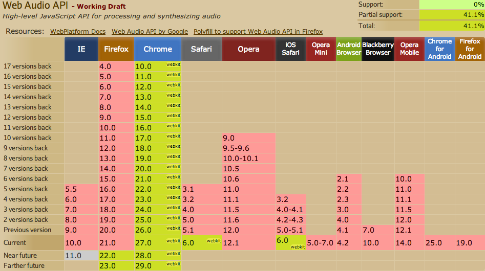

# Best Foot Forward

<aside class="notes">
  First implementation of Frozen sound - WebAudio only, otherwise nothing
</aside>

^^

## Something Right

<ul class="fragment">
  <li>Started with WebAudio</li>
</ul>

<h2 class="fragment">Something Horribly Wrong</h2>

<ul class="fragment">
  <li>Only WebAudio</li>
</ul>

<aside class="notes">
  And hope browser support increases
</aside>

^^

## Browser Support?



[Firefox Bug](https://bugzilla.mozilla.org/show_bug.cgi?id=779297) | [Android Bug](https://code.google.com/p/chromium/issues/detail?id=112930)

<aside class="notes">
  Has been in Chrome since v10, just now getting to iOS and still not in Chrome for Android or Firefox
</aside>

^^

# Falling Back

## What Do We Get?

* High Performance
* Low Latency
* Uses Buffers instead of Resource Loading

^^

# Initialization

## WebAudio

```javascript
var audioContext;
if(window.AudioContext){
  audioContext = new window.AudioContext();
}
```

## HTML5 Audio

```javascript
var audio = new Audio();
```

^^

# Loading

## WebAudio

```javascript
var audioBuffer;
if(audioContext){
  var request = new XMLHttpRequest();
  request.open('GET', 'epic-theme.mp3', true);
  request.responseType = 'arraybuffer';

  function decodeAudioData(e){
    audioContext.decodeAudioData(e.target.response, function(buffer){
      audioBuffer = buffer;
    }, onError);
  }

  request.addEventListener('load', decodeAudioData);
  request.send();
}
```

^^

# Loading

## HTML5 Audio

```javascript
audio.src = 'epic-theme.mp3';
```

^^

# Playing

## WebAudio

```javascript
var source = audioContext.createBufferSource();
source.buffer = audioBuffer;
source.connect(audioContext.destination);
source.start(0); // source.noteOn(0);
```

## HTML5

```javascript
audio.play();
```

^^

# Volume

## WebAudio

```javascript
var gainNode = audioContext.createGain();
source.connect(gainNode);
gainNode.connect(audioContext.destination);

gainNode.gain.value = 0.5;
```

## HTML5

```javascript
audio.volume = 0.5;
```

^^

# So Complicated

^^

# Extras!

* Mixing, Processing, Filtering
* Smooth Transitions
* Sound Creation
* Modular - Node System
* Designed for Future Features

^^

# Make a Sound!

```javascript
var context = new webkitAudioContext();
var sineWave = context.createOscillator();

sineWave.connect(context.destination);

sineWave.start(0);
```
[Fiddle](http://jsfiddle.net/phated/WhUbJ/)
